<h1 align="center">📦 Mega-Analysis Project</h1>

  
  
  

## 🔖 Overview

This project demonstrates a full-cycle e-commerce data analysis solution developed collaboratively using modern data technologies. As the **team leader**, I spearheaded the effort to collect, clean, model, and visualize data to derive actionable business insights and predictive intelligence. The project was organized and tracked through **Notion**, with clear task delegation and transparent collaboration.

---

## 🔗 Project Artifacts

* **Notion**  
  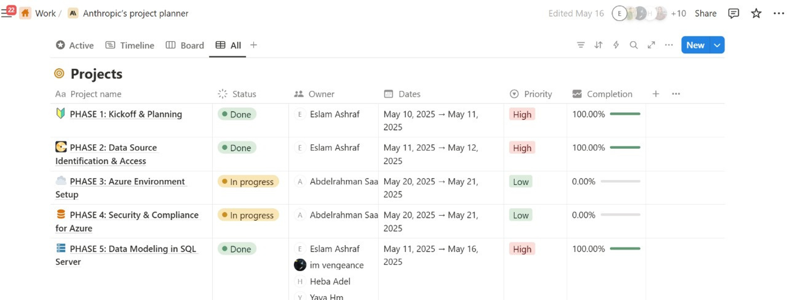  
  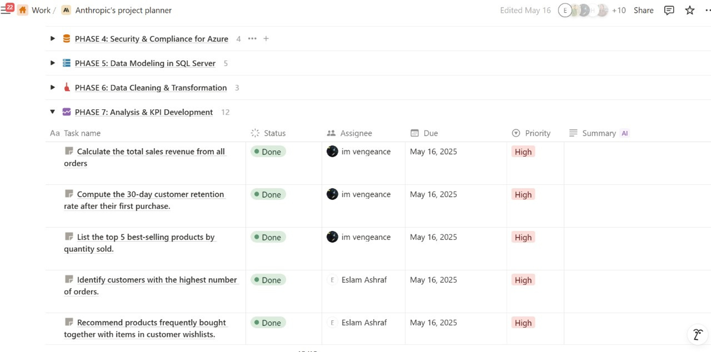

* [📚 **Database Dictionary**](./data_dictionary/database_dictionary.pdf)

---

## 🧩 Tools & Technologies

* **Cloud Platform:** Azure SQL Database
* **Data Cleaning & Processing:** SQL Server, Python (`pandas`, `pyodbc`, Mito)
* **Visualization:** Power BI
* **Machine Learning:** scikit-learn, XGBoost

---

## 🗂️ Project Phases

### 1. ☁Creating and Connecting the database on Azure

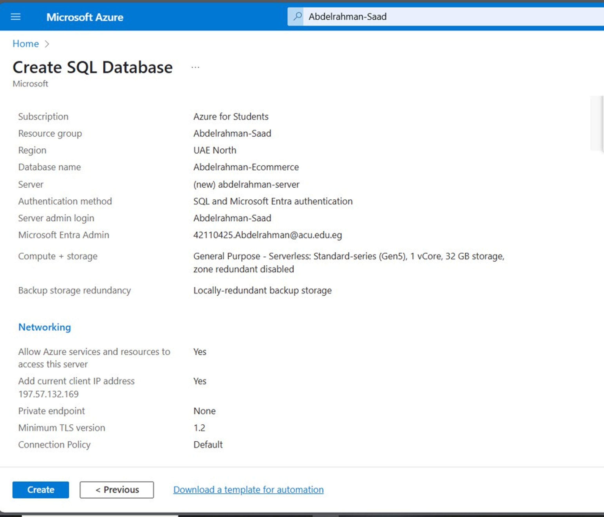  
  
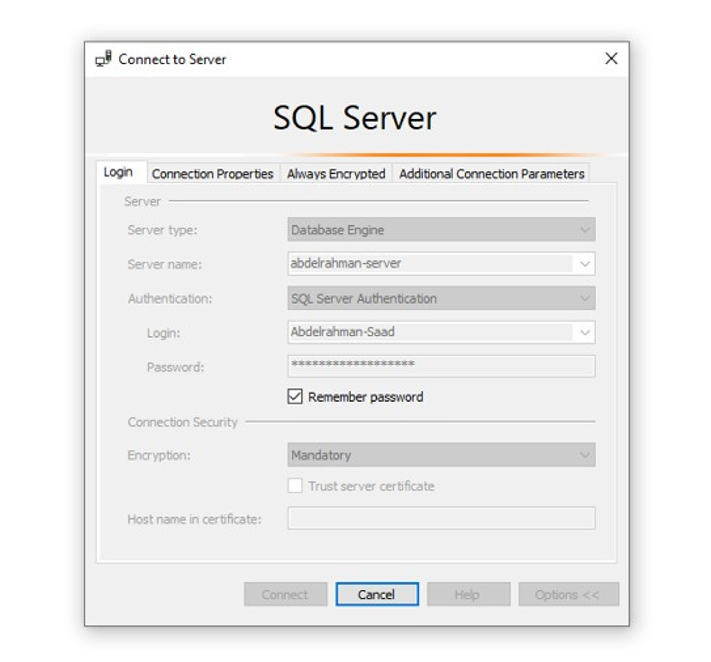

---

### 1. 🔍 Data Cleaning & Validation (SQL Server)
" make sure to read the docs it contains all the insights with its recommenadations. "
Performed rigorous data audits using dynamic SQL, foreign key checks, and NULL validations across all tables:

* Removed duplicates and invalid rows
* Standardized date and numeric formats
* Detected and flagged:

  * Orders with zero/negative values
  * Inventory movements with zero quantity
  * Customers with no orders
  * Unused or overstocked products

**Advanced SQL queries included:**

* Customer retention analysis
* Inventory turnover (30-day moving average)
* Product bundling insights
* Delivery time evaluation

📌 Created **department-specific views** for secure, role-based data access.

---

### 2. 📈 Business Intelligence Dashboard (Power BI)

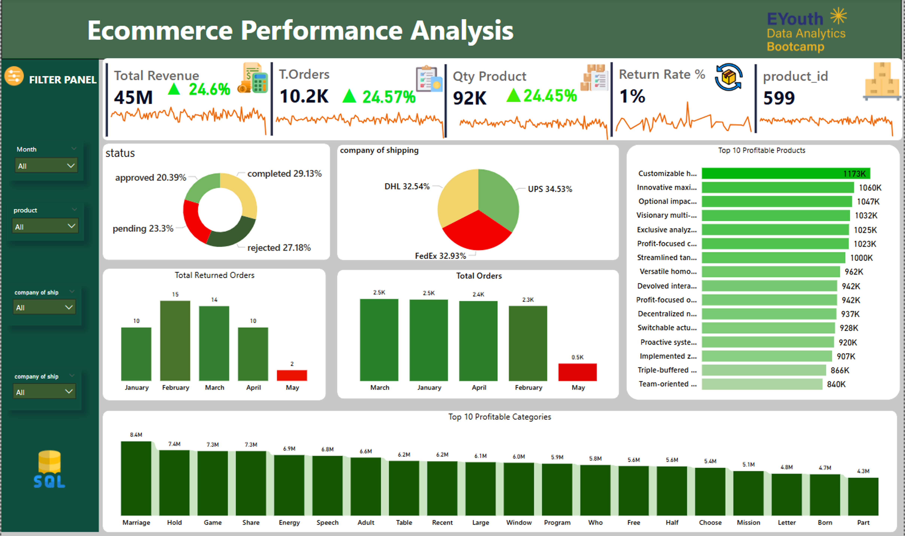  
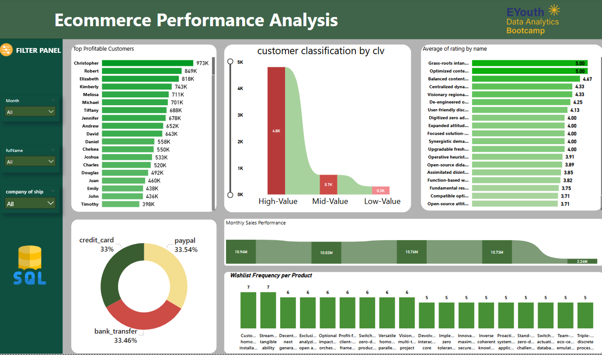  
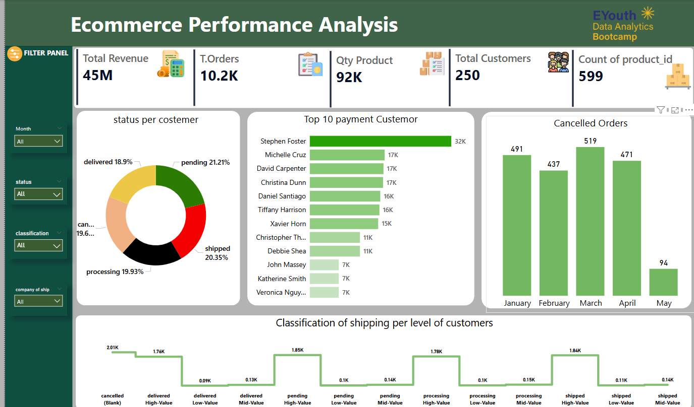  
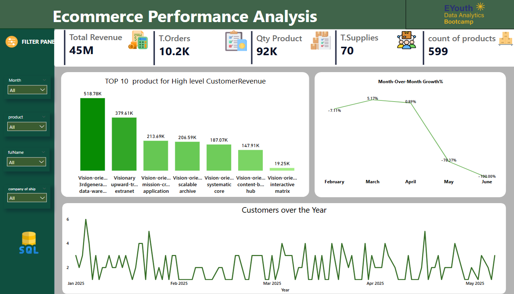  
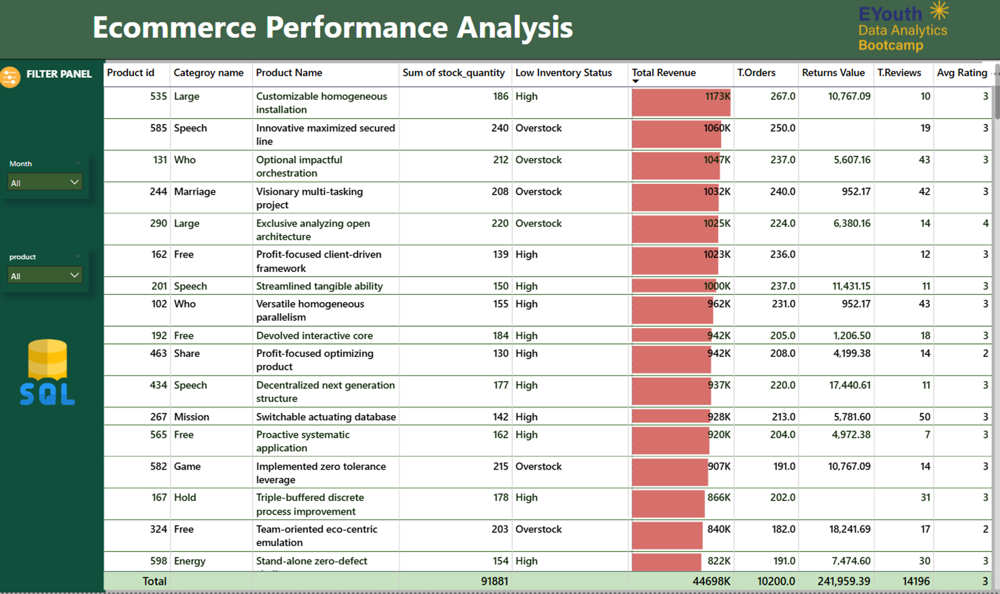

**Key KPIs & Metrics:**

* 🧾 **Total Revenue:** \$45M (+24.6%)
* 📦 **Total Orders:** 10.2K (+24.57%)
* 🔁 **Return Rate:** 1% *(very low – excellent customer satisfaction)*

**📊 Visualized Insights:**

* Top products and categories by revenue
* Return analysis by status and time
* Shipping provider distribution
* Monthly order trends and anomalies *(notably a critical 75% drop in May)*

⚠️ **Actionable Alerts:** Triggered for inventory below 20 units.

**Recommendations based on insights:**

* Optimize supply chain for high-turnover products
* Review return policies and product quality for high-return items
* Investigate potential operational issues causing sales drops

---

### 3. 💬 Natural Language SQL with Vanna AI
We integrated **Vanna AI** to allow team members and stakeholders to **query the SQL database using plain English**, significantly improving accessibility and speeding up analysis.

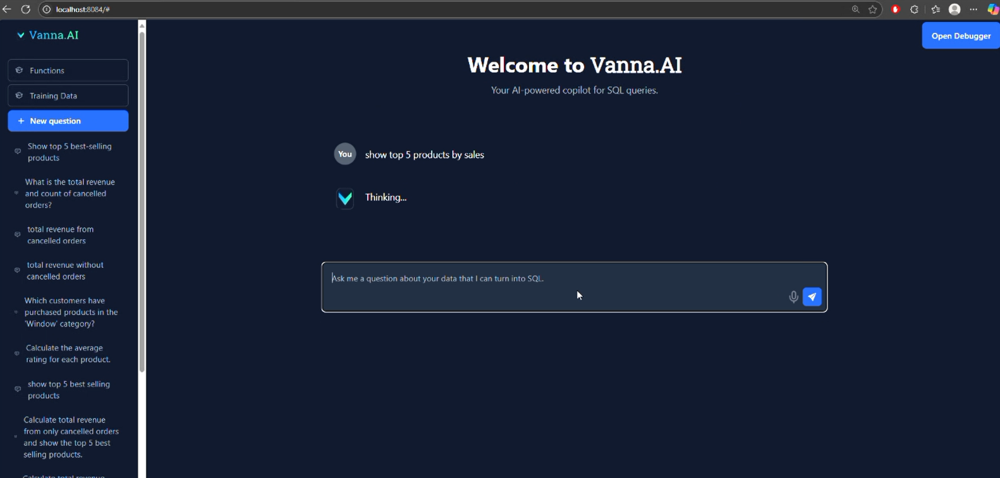
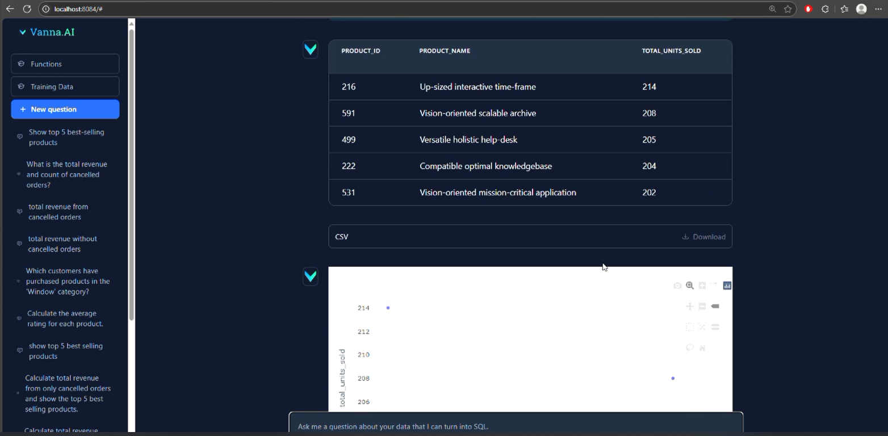
🔍 **What Vanna AI Enables**
* Translate natural language questions into **SQL queries**

* Automatically run queries on the **Azure SQL Database**

* Return instant results and visualizations for:

* Sales trends

* Customer behavior

* Inventory insights

* Product performance

⚙️ **How It Was Set Up**
* Connected Vanna AI to the **Azure-hosted SQL Server**

* Provided table schemas and metadata for accurate querying

* Trained Vanna using actual questions asked during the project

* Embedded Vanna into the workflow to support non-technical teammates

✅ **Outcomes**
* Reduced dependency on technical team members for daily insights

* Enabled faster decision-making during meetings and presentations

* Improved cross-functional collaboration between business and technical roles

---

### 4. 🧠 Machine Learning Pipeline (Python)

**🛠 Tools:**

* Data Wrangling: Mito, pandas
* DB Connection: pyodbc
* ML Libraries: scikit-learn, XGBoost
* Visualization: Seaborn, Matplotlib
* Model Serialization: joblib

**📋 Pipeline Overview:**

**Data Acquisition:**

* Extracted from SQL Server into pandas DataFrames
* Stored in Python dictionaries for modular access

**Feature Engineering:**

* Time-based features (order month/day, customer age)
* Repeat buyer flags, order value metrics
* Customer segmentation via behavior patterns

**Preprocessing:**

* Imputation, scaling, encoding via Pipelines

**Modeling:**

* **Random Forest Regressor:** Baseline model
* **XGBoost Regressor:** Final model with highest accuracy

🧠 **Result:** XGBoost outperformed Random Forest in RMSE and R²  
📈 **Outcome:** Enabled accurate customer order value prediction

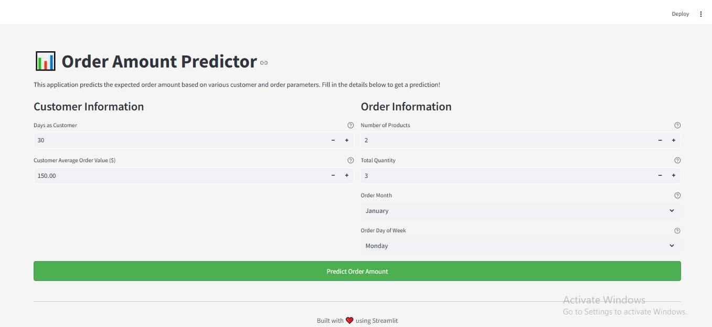  
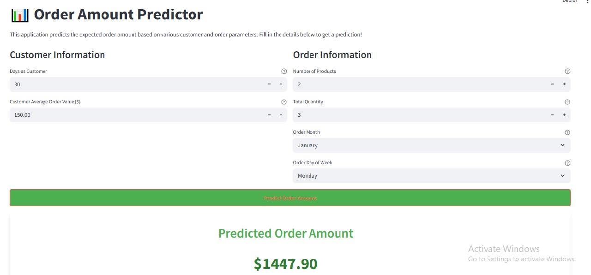

---

## 🎯 Final Insights & Recommendations

* 🚀 **91% 30-day customer retention rate:** Excellent early engagement – introduce tiered loyalty programs
* 📉 **Products rated ≤ 3 stars:** Launch feedback forms and incentivized review programs
* 💡 **Frequently bought-together pairs:** Bundle for upselling opportunities
* 🔁 **Orders with discounts underused:** Rethink discount visibility and targeting strategy

---

## 🏆 Key Contributions

* ✅ Led a cross-functional team and coordinated efforts via Notion
* ✅ Designed scalable SQL queries and dashboards for business users
* ✅ Implemented full-stack analytics from data extraction to insight delivery
* ✅ Used cloud-first architecture (Azure SQL, Power BI) for real-time, scalable solutions

---

📬 *For inquiries or collaboration opportunities, feel free to reach out!*
